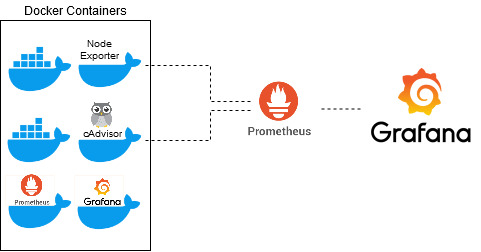
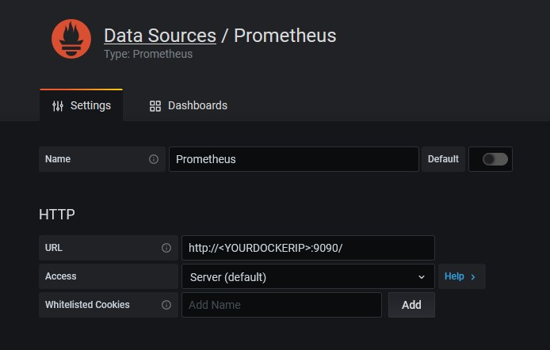
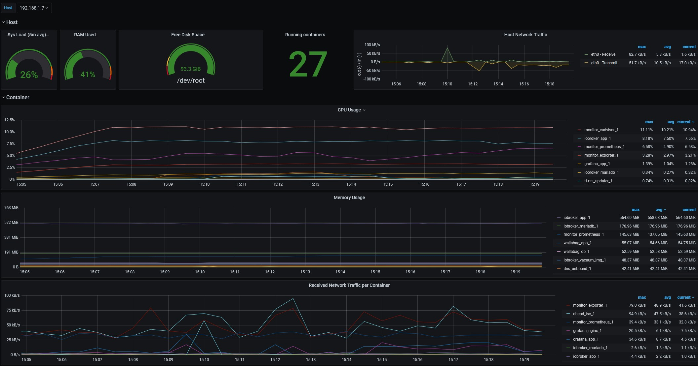

In this blog, we are implementing monitoring for Docker containers using Docker images.
We will use the following open-source options for the monitoring task:

- [Grafana][grafana]
- [cAdvisor][cadvisor]
- [Prometheus][prometheus]
- [node exporter][node_exporter]

To keep things simple, we will provide all the necessary tools via docker and only make very few adjustments.

## Enable cgroups limit support

First let's see if docker stats provides us with all information.
On my Rasperry Pi 4 the MEM usage was 0.00% for every container on the `docker stats --no-stream` output.

```console
CONTAINER ID        NAME                    CPU %               MEM USAGE / LIMIT     MEM %               NET I/O             BLOCK I/O           PIDS
234aaa99f2d0        gq-gmc-service_app_1    0.03%               0B / 0B               0.00%               5.32kB / 0B         10.5MB / 0B         1
```

Append `cgroup_enable=cpuset cgroup_enable=memory cgroup_memory=1` in the `/boot/cmdline.txt` to enable cgroup memory option.

Additionally, the following lines should be added to `/etc/docker/daemon.json`.

```xml
{
  "exec-opts": ["native.cgroupdriver=systemd"]
}
```

If the file is not empty,these key, making sure that the resulting file is valid JSON. Be careful that every line ends with a comma (,) except for the last line.

Now Docker uses systemd as cgroupdriver.

After a reboot we can see the memory usage of the containers.

```console
CONTAINER ID        NAME                    CPU %               MEM USAGE / LIMIT     MEM %               NET I/O             BLOCK I/O           PIDS
234aaa99f2d0        gq-gmc-service_app_1    0.02%               12.16MiB / 3.738GiB   0.32%               5.39kB / 0B         10.5MB / 0B         1
```

<br/>

## Docker container

Now we provide all necessary tools as a docker container using docker-compose.
Therefore we create the file `docker-compose.yml` with the following content:

### docker-compose.yml

```yml
version: '3.7'
services:
  prometheus:
    image: prom/prometheus
    restart: always
    ports:
      - "9090:9090/tcp"
    networks:
      - front
    volumes:
      - ./prometheus.yml:/etc/prometheus/prometheus.yml:ro
      - prometheus_data:/data:rw
    command:
      - '--config.file=/etc/prometheus/prometheus.yml'
      - '--storage.tsdb.path=/data'
      - '--storage.tsdb.retention.time=30d'
      - '--web.console.libraries=/etc/prometheus/console_libraries'
      - '--web.console.templates=/etc/prometheus/consoles'
  exporter:
    image: prom/node-exporter
    restart: always
    volumes:
      - /proc:/host/proc:ro
      - /sys:/host/sys:ro
      - /:/rootfs:ro
    command:
      - '--path.procfs=/host/proc'
      - '--path.sysfs=/host/sys'
      - --collector.filesystem.ignored-mount-points
      - "^/(sys|proc|dev|host|etc|rootfs/var/lib/docker/containers|rootfs/var/lib/docker/overlay2|rootfs/run/docker/netns|rootfs/var/lib/docker/aufs)($$|/)"
    network_mode: host

  cadvisor:
    image: zcube/cadvisor
    restart: always
    privileged: true
    devices:
      - /dev/kmsg
    ports:
      - "8080:8080/tcp"
    command:
      - '--docker_only'
      - '--disable_metrics=disk,diskIO,tcp,udp,percpu,sched,process'
      - '--housekeeping_interval=10s'
    networks:
      front:
        aliases:
         - cadvisor
    volumes:
      - /:/rootfs:ro
      - /var/run:/var/run:ro
      - /sys:/sys:ro
      - /var/lib/docker/:/var/lib/docker:ro
      - /dev/disk/:/dev/disk:ro
      
    grafana:
        image: grafana/grafana
        ports:
          - "3000:3000/tcp"
        networks:
          front:
        volumes:
          - grafana_data:/var/lib/grafana
        environment:
          - GF_AUTH_ANONYMOUS_ENABLED=true

networks:
  front:
    driver: bridge

volumes:
  prometheus_data:
  grafana_data:
```

additionally we create a folder `grafanadata` and a file `prometheus.yml` with the following content:

### prometheus.yml

```yml
scrape_configs:
  - job_name: 'containeradvisor'
    scrape_interval: 5s
    static_configs:
      - targets: ['X.X.X.X:8080']

  - job_name: 'node-exporter'
    scrape_interval: 5s
    static_configs:
      - targets: ['X.X.X.X:9100']
```

{: .box-note}
For the `targets` please enter your Docker host IP or DNS name.

Now we can start our containers with the following command `docker-compose up -d`.

## Grafana

Now we can login to Grafana `http://<DOCKERIP>:3000` with user User `admin` and the passwort `admin`.


add data source Prometheus to Grafana. The URL ist the one of oure Prometheus container.



We can now import a dashboard, by entering the ID `12831` or any other ID of one of Grafana's dashboards provided on the [Grafana Dashboard][grafana_dashboards] side.


now we have a quick overview of our Docker system load. 



[node_exporter]: https://github.com/prometheus/node_exporter
[grafana]: https://grafana.com
[grafana_dashboards]: https://grafana.com/grafana/dashboards
[cadvisor]: https://github.com/google/cadvisor
[prometheus]: https://prometheus.io/
