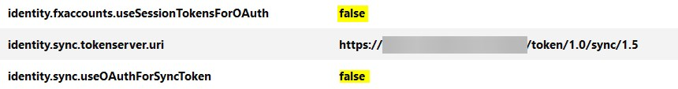

Since the Firefox update to version 80 and 79 on android a few things have changed to be able to use your own syncserver as described in the blog post [Setup your own Firefox Sync Server with Docker](/2018-11-03-firefox-syncserver-with-docker/).

## Desktop

{: .box-warning}
With syncserver version 1.9.0 (git commit: `21717e3` or docker digest: `bf581395981a`) the error is fixed and the workarround for Firefox Desktop is no longer needed.

In addition to the `identity.sync.tokenserver.uri` settings for the syncserver URL, the following settings must be set to `false`.

```txt
identity.fxaccounts.useSessionTokensForOAuth
identity.sync.useOAuthForSyncToken
```



After that you can synchronize again with your own syncserver.

## Android

The `about:config` page no longer exists in this version for Android.
So the procedure to enter the syncserver URL is now as follows:

1. Go to Settings
2. About Firefox
3. Click 5 times on to the Firefox logo until `Debug menue is enabled` appears
4. Go back to settings
5. Now you see under the Account options the option `Userdefined syncserver`, Enter your syncserver URL here.

<br />
<br />

### Update

2020-09-05 Add info about new syncserver version (workaround is no longer needed)
