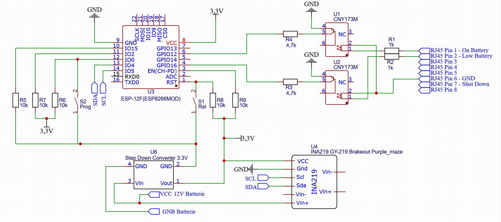
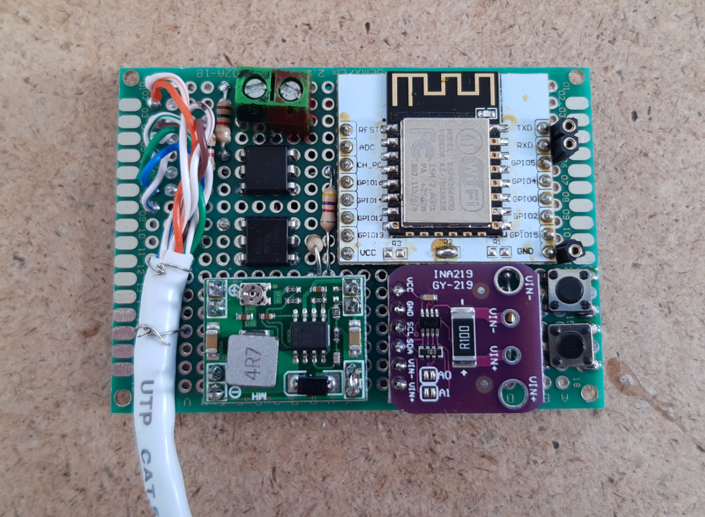
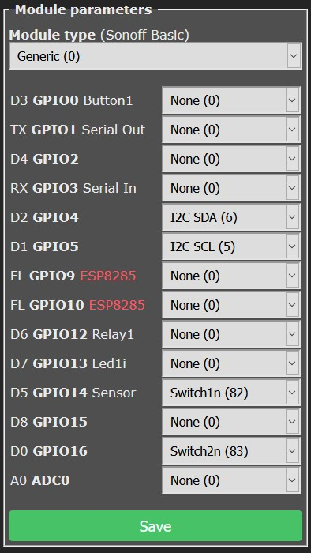
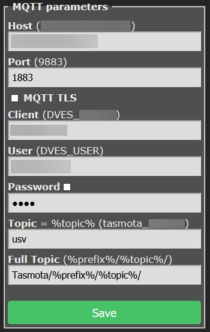
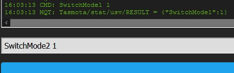

I still have an APC Back-UPS CS500 which protects my Synology, Rasperry PI and co.
Since it's not network-capable and only has "Simple Signalling", I want to do this with an ESP8266 smart.

I didn't want to tinker with the UPS circuit because of the main voltage, I use the "Simple Signalling" interface to achieve the goal. The "Simple Signalling" interface is not a USB or RS232 interface!

## Pin Assignment "Simple Signalling" Interface

Since I had no RJ50 plug, but a RJ48 plugs fit also, I used an old network cable for the connection, this also fits into the RJ50 socket, but then pin 1 and 10 are not usable.

| RJ50 |                                                              | RJ48 |
| ---- | ------------------------------------------------------------ | ---- |
| 1    | +5V (10 mA)                                                  | -    |
| 2    | Signal *On Battery* or *Line Fail*: Low = Line Fail, High (Ubat) = On Battery | 1    |
| 3    | Signal *Low Battery*: Low = *Battery* full, High (Ubat) = *Battery* empty | 2    |
| 4    | CHASGND (Schiermung)                                         | 3    |
| 5    | not connected                                                | 4    |
| 6    | not connected                                                | 5    |
| 7    | GND                                                          | 6    |
| 8    | Signal Shut Down                                             | 7    |
| 9    | USB Signal D-                                                | 8    |
| 10   | USB Signal D+                                                | -    |

<br />

## Schematic

An ESP8266-12 is used, two Optocoupler CNY17-3 for the signal "On Battery" and "Low Battery". Additionally an INA219 breakout board to monitor the battery voltage, an DC-DC converter go get the 3.3V for the ESP8266 and some resistors and two trigger.




The whole packaged in a case and attached to the UPS.


## Software

For the software I used Tasmota, which sends all necessary information to the network via MQTT.

First of all Download `tasmota-sensors.bin` and flash it to the ESP8266. For flashing you can follow the [Getting Started](https://tasmota.github.io/docs/Getting-Started/) guide.

### Configuration

The module must be configured in the following way so that the UPS states can be queried.





Enter the following commands in the web interface `console`.


Change the Voltage sensor resolution to two decimal places with `VoltRes 2`.

Configure the switches so that no standard MQTT messages are sent and that 0 = OFF and 1 = ON.

```conf
SwitchMode1 1
SwitchTopic1 0
SwitchMode2 1
SwitchTopic2 0
```

To send the status of the UPS via MQTT, a rule must be created.

```conf
Rule1
ON Switch1#state=0 DO publish Tasmota/stat/usv/OnLine %value% ENDON
ON Switch1#state=1 DO publish Tasmota/stat/usv/OnLine %value% ENDON
ON Switch1#state DO publish TelePeriod ENDON
ON Switch2#state=0 DO publish Tasmota/stat/usv/LowPower 1 ENDON
ON Switch2#state=1 DO publish Tasmota/stat/usv/LowPower 0 ENDON
ON Switch2#state DO publish TelePeriod ENDON
```

Additionally with `TelePeriod 60` every 60 seconds a status update is sent to the topic `Tasmota/stat/usv/STATE`.

Now the systems which should be shut down in case of a power failure can subscribe to the topic `Tasmota/stat/usv/LowBattery` via MQTT and initiate a shutdown.

## Links

- [Tasmota](https://tasmota.github.io/docs/)