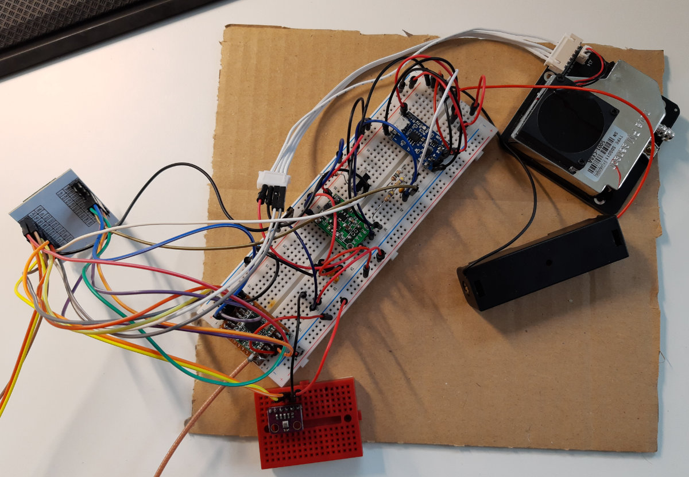
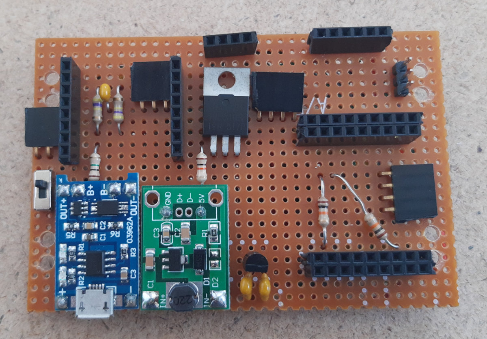

This year I tinkered with an environmental sensor, which should be solar powered and transmit the readings via LoraWAN (thethingsnetwork).

The sensor should provide the following measured values:

- Fine dust (SDS011)
- Temperature / Humidity / Air pressure (BME280)
- UV Index (VEML6075)
- LUX (TSL2591)

To save power it was clear that no ready to use ESP32 module could be used, because they consume too much power in DeepSell. Therefore I used a WROOM32 module.
Furthermore, the SD011 sensor had to be switched on and off, otherwise it consumes an extremely large amount of power.
I realized this with an N-channel MOSFET (IRL3103PBF).
The power supply is a 18650 battery which is charged by solar module. To keep the 3.3V limit for the ESP, a regulated MCP1700-3302E is used.
Since the SD011 needs 5V, but the rest of the components work with 3.3V, a step-up converter is used.

After a bit of trial and error and a breadboard setup, I put the whole thing on pin hole PCB and and fitted everything into a waterproof housing.

After a few months of use, it soon became apparent that the simple solar panels are not suitable for outdoor use.
The surface became rougher and rougher and the performance decreased extremely.

Therefore, in the meantime, a solar panel with a glass cover is used.

Let's see what the long-term experience shows whether the system works properly.

I load the data via MQTT and Telegraf into an InfluxDB and visualize the measured values via Grafana.

I published the whole project on [GitHub JackGruber / esp32_ttn_environmental_sensor](https://github.com/JackGruber/esp32_ttn_environmental_sensor).

## Links

- [GitHub Project](https://github.com/JackGruber/esp32_ttn_environmental_sensor)
