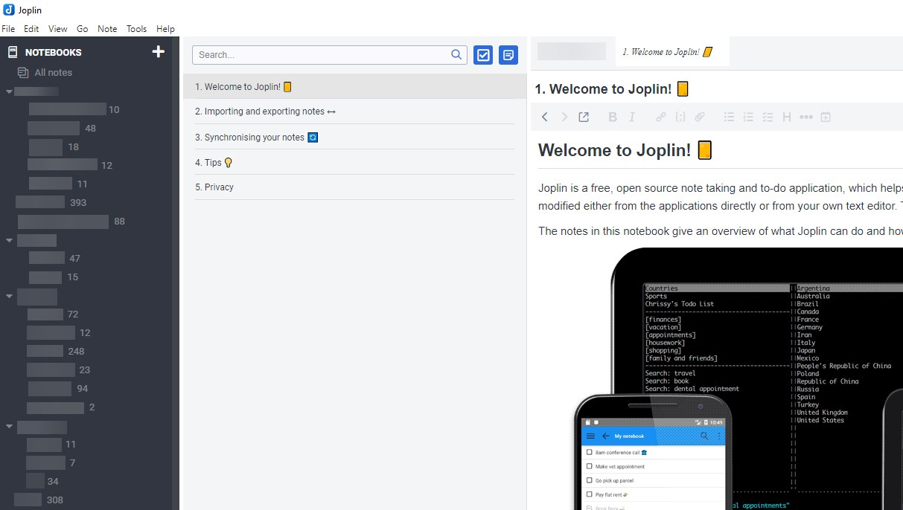

For the past year, I've been using Joplin for my note management. Previously, I had used Evernote for years, but wanted to get away from it, because all notes stored in the cloud.

## Pros / Cons

A few pros in my opinion of Joplin are:

- Various sync destinations available (WebDav, DropBox, OneDrive, File System, ...)
- OpenSource
- API available
- Plugings (Only recently)
- Relies on Markdown, but there is a WYSIWYG editor available
- E2EE (End-to-end encryption) to protect the data on cloud systems

Of course, there are not only advantages, but also disadvantages:

- In my opinion, the mobile apps are currently not very suitable for writing notes
- No offline notebooks like in Evernote
- No possibility not to synchronize all notebooks
- No preview of notes, only a note list
- No OCR for included documents
- It is not possible to open several notes at the same time
- Tables are a bit limited in Markdown
- No Sharing / Cooperation options (Currently a Joplin server is under development to make this possible)

## Switching from Evernote to Joplin

In Evernote I exported each notebook as a separate `enex` file and then imported it into Joplin as `markdown`.

This worked fine for my 5000+ notes and 1700 tags.
There is some formatting that is no longer as it was in Evernote, but this is due to markdown or minor errors in the import and was no big problem. In the meantime, the enex import was optimiezed in the last versions and should therefore work even better.

After that, I selected WebDAV on my Synology as the sync target and synced all the data. The first synchronization took a few hours. When this was completed, I set up my mobile devices and other computers for syncronisation. Since the synchronization only works in the foreground on mobile devices (iOS and Android), you can not switch to other Apps or turn the Display off!

Since I don't use public cloud and my shares are encrypted on the Synology, I don't have E2EE (end-to-end encryption) set up.

## Workflows / Optimizations

### Copy Tags

What I missed extremely in my workflows was to mark multiple notes and copy/delete the tags via `Ctrl+T`. Unfortunately, this function does not exist in Joplin.
Therefore I wrote my own plugin [Copy tags](https://github.com/JackGruber/joplin-plugin-copytag), which copies the tags of the first marked note to all others.

### OCR

One great thing about Evernote was that every PDF and other document was OCRed and searchable in Evernote.

Unfortunately, this function does not exist in Joplin, but in the meantime I have started to import all my scanned PDF documents with OCR recognition into Joplin, so that they may be searchable later.

I scan my PDF documents with a `Fujitsu ScanSnap IX100` and upload them from the Synology drive to a share of my Syno, where they are converted to a PDF with text overlay by `OCRmyPDF` which runs on Docker on the Syno. Afterwards this PDF is imported into Joplin.

### Hotfolder

The hotfolder function I realized very fast using Python and the Joplin API. The script `hotfolder.py` can be found in my Git Repro [Joplin-Tools](https://github.com/JackGruber/Joplin-Tools).

### PDF Preview

Since version `v1.5.7` Joplin Desktop supports an inline viewer for PDF files. Since this was not possible before and is not available on mobile, I have added a preview of the first PDF page in each note. I have done this after the Import from Evernote with my Script `add_pdf_previews.py`. For new documents, which are imported via hotfolder, this is done automatically.

## Conclusion

The whole thing was a big change and a few of my workflow/usages had to be adjusted. But in the meantime I don't miss Evernote anymore and the Joplin community and developers are great.

## Interesting Plugins / Tools

- [Kindle highlights in Joplin](https://gitlab.com/seawind/kindle-highlights-in-joplin)
- [Copy tags Plugin](https://github.com/JackGruber/joplin-plugin-copytag)
- [Note Tabs Plugin](https://github.com/benji300/joplin-note-tabs)
- [Outline (TOC) Plugin](https://github.com/cqroot/joplin-outline)
- [Joplin Forum for Plugins](https://discourse.joplinapp.org/c/plugins/)

## Links

- [Joplin](https://joplinapp.org)
- [GitHub JackGruber / Joplin-Tools](https://github.com/JackGruber/Joplin-Tools)
- [GitHub JackGruber / joplin-plugin-copytag](https://github.com/JackGruber/joplin-plugin-copytag)